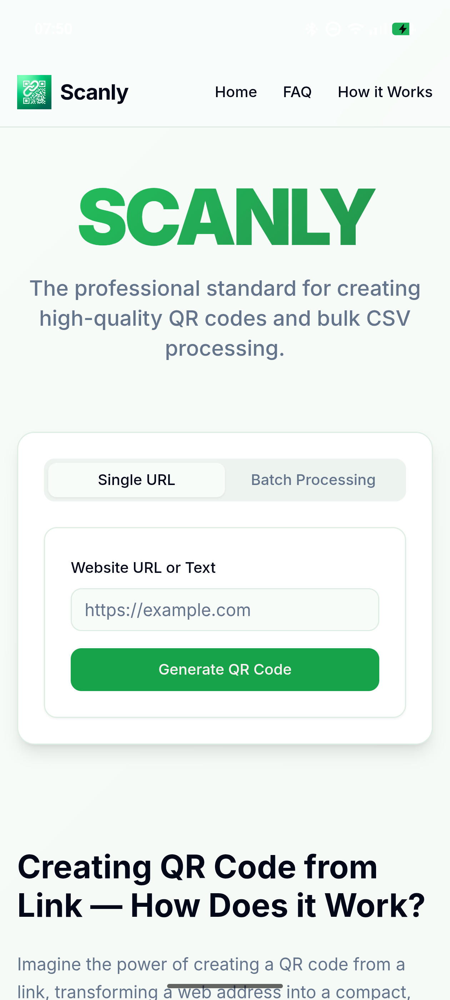
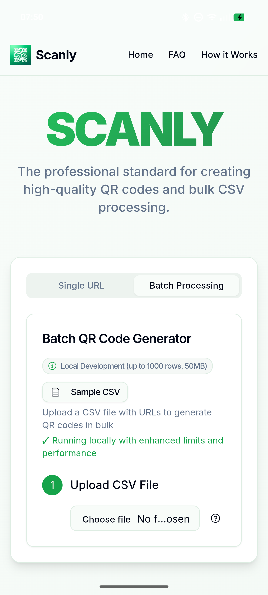
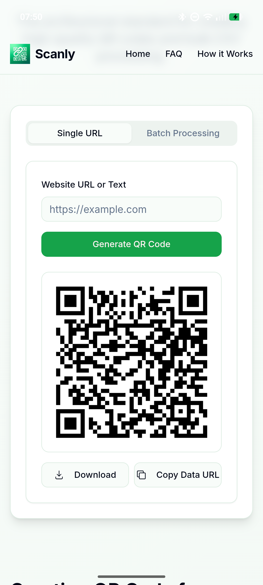
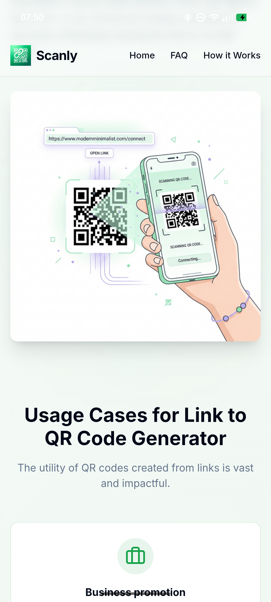

  

  # 🔗 Scanly

  ### *The Professional Standard for Single & Bulk QR Code Generation*

  Developed by **Rahul Loyal Dalmas** | Powered by **Shruhh.inc**

  
  
  

  ---

  

    <strong>Scanly</strong> is a premium, high-performance utility application designed to instantly convert links and text into high-quality QR codes. Engineered with Next.js, React, Tailwind CSS, and Capacitor, Scanly supports both single-code rendering and high-throughput batch CSV processing to create, preview, and download thousands of QR codes entirely client-side.
  

  <h4>
    <a href="#-key-features">Key Features</a> •
    <a href="#-application-screenshots">Screenshots</a> •
    <a href="#-technical-architecture">Tech Stack</a> •
    <a href="#%EF%B8%8F-download--installation">Download APK</a> •
    <a href="#-developer--socials">Developer Details</a>
  </h4>

---

## ⚡ Download Options

  
  
  <h3>OR</h3>

  
  
<em>Get the latest build for Android! Experience full-screen native interaction, safe notifications-padding, and lightning-fast QR code creation on the go.</em>

---

## ✨ Key Features

### 1. 🔗 Single QR Code Generator
*   **Instant Rendering**: Type or paste any website URL or text and watch the QR code generate in real time.
*   **Export Actions**: One-click download as a high-quality PNG image or copy the raw Base64 data URL directly to your clipboard.

### 2. 📊 High-Performance Batch Processing
*   **Bulk Generation**: Upload standard CSV spreadsheets containing up to 1,000 links (files up to 50MB) for rapid batch processing.
*   **Column Selector**: Dynamically select which spreadsheet column contains the target URLs.
*   **Sample CSV**: Includes a downloadable sample CSV structure directly within the app interface to get started immediately.

### 3. 🛡️ Complete Privacy & Security
*   **100% Client-Side**: All file reading, CSV parsing, and QR compilation happen locally on your device.
*   **Zero Server Communication**: Your links, data, and CSV spreadsheets never leave your device, guaranteeing total data confidentiality.

### 4. 📱 Premium Native Android Experience
*   **Capacitor Integration**: Compiled into a native Android application with responsive touch handling, system theme adaptation, and native gestures.
*   **Optimized Padding**: Designed to gracefully clear native system elements (such as notification headers and navigation pill overlays) on modern devices.

---

## 📱 Application Screenshots

  <table style="border: none; border-collapse: collapse; width: 100%; max-width: 600px;">
    <tr>
      <td style="padding: 10px; border: none; text-align: center; width: 50%;">
        
<strong>Main Interface (Single URL)</strong>

        
      </td>
      <td style="padding: 10px; border: none; text-align: center; width: 50%;">
        
<strong>Batch QR Code Generator</strong>

        
      </td>
    </tr>
    <tr>
      <td style="padding: 10px; border: none; text-align: center; width: 50%;">
        
<strong>Generated QR Code Output</strong>

        
      </td>
      <td style="padding: 10px; border: none; text-align: center; width: 50%;">
        
<strong>Usage & Guide Information</strong>

        
      </td>
    </tr>
  </table>

---

## 🛠️ Technical Architecture

### Core Tech Stack
*   **Web Framework**: [Next.js 15](https://nextjs.org/) (App Router & React Client State)
*   **UI Engine**: [React 19](https://react.dev/) & [Tailwind CSS](https://tailwindcss.com/)
*   **Component System**: Custom Tailwind-animated components and [Shadcn/UI](https://ui.shadcn.com/)
*   **CSV Parsing Engine**: [PapaParse](https://www.papaparse.com/) for high-speed client-side spreadsheet analysis
*   **Mobile Wrapper**: [Capacitor.js 6](https://capacitorjs.com/) for native Android platform building

---

## 📥 Download & Installation

### Android APK Setup
1. Navigate to the [Releases](https://github.com/rahulloyal/Scanly/releases) section of this repository.
2. Download the latest **`Scanly.apk`** installation package.
3. Locate the downloaded file on your Android device and open it.
4. *If prompted, allow installations from unknown sources in browser/files settings.*
5. Launch **Scanly** from your application drawer and start generating QR codes!

---

## 👤 Developer & Socials

### Developed by **Rahul Loyal Dalmas**
Powered by **Shruhh.inc**

Get in touch or follow the developer's work:

&nbsp;&nbsp;

---

## 📄 License
This showcase repository and its documentation are licensed under the [MIT License](LICENSE).
